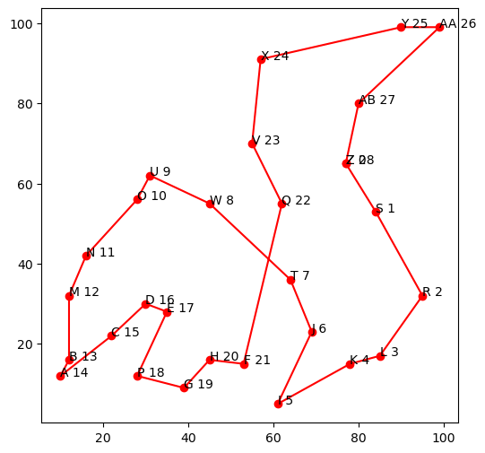

# Optimización de ruta con algoritmo genético
En este proyecto implemento un algoritmo genético para resolver el problema de optimización para calcular la mejor ruta entre un número determinado de ciudades.

